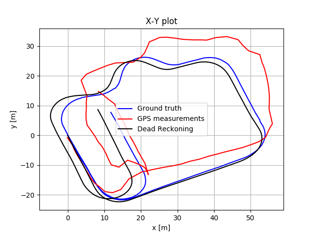
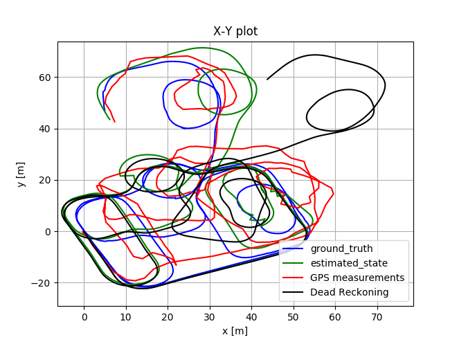
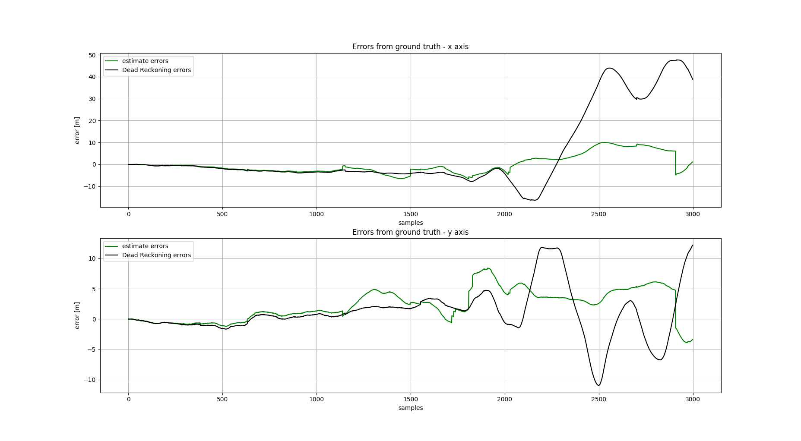
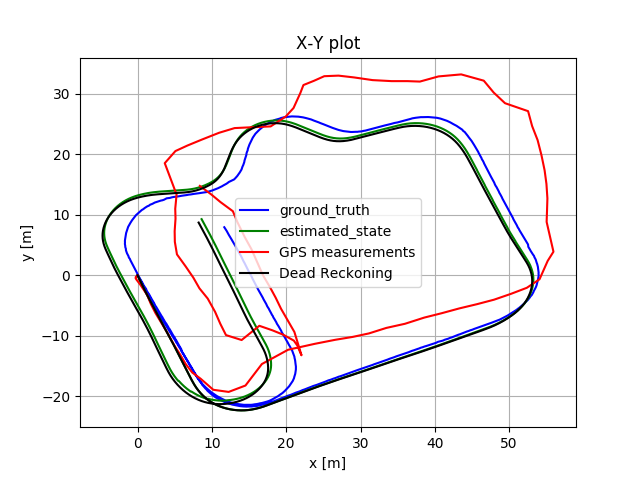

# Extended Kalman Filter for GPS and Dead Reckoning fusion

EKF fusing GPS and dead reckoning measurements. The results are compared to ground truth measurements obtained by a RTK GPS.
The dataset used comes from the following source:

http://ipds.univ-bpclermont.fr/index.php

## Installation

1. Install python 3.
2. Install the requirements using pip:
```
pip install -r requirements.txt
```
##

## Usage examples

### To take a look at the dataset:

```
python check_dataset.py
```




### To run the EKF on the dataset:

```
python run_filter.py
```





The EKF can also be run only on a small segment of the dataset (options are 'basic' and 'full'):

```
python run_filter.py --dataset=basic
```




